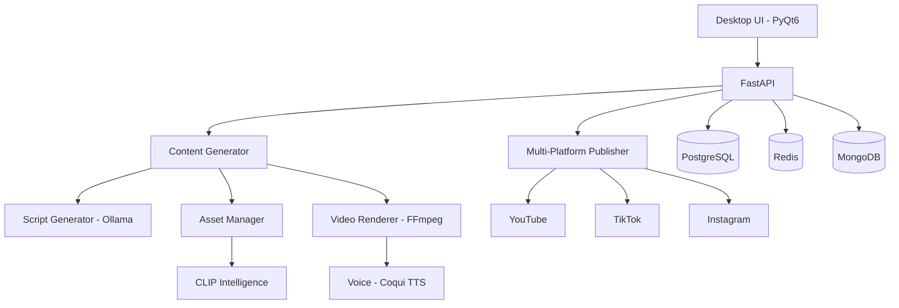

# Faceless YouTube Automation Platform v2.0

**Autonomous AI-Powered Content Generation & Multi-Platform Publishing**

[](https://www.gnu.org/licenses/agpl-3.0)
[](https://www.python.org/downloads/)
[](https://github.com/psf/black)

---

## 🎯 **Mission**

Transform faceless video content creation into a fully autonomous, AI-driven platform capable of generating, optimizing, and distributing high-engagement content across 8+ platforms with **90%+ automation** and **zero daily human intervention**.

---

## ✨ **Key Features**

### Current (v1.0)

- ✅ Desktop UI (PyQt5) for video generation
- ✅ Basic script input
- ✅ gTTS voice synthesis
- ✅ Manual asset selection via JSON
- ✅ YouTube upload with OAuth
- ✅ Basic analytics dashboard

### Target (v2.0 - In Development)

- 🎯 **AI Script Generation** (Ollama/GPT4All - FREE)
- 🎯 **Automated Asset Discovery** (10+ free stock sources)
- 🎯 **Intelligent Asset Selection** (CLIP + ML)
- 🎯 **Multi-Platform Publishing** (YouTube, TikTok, Instagram, LinkedIn, Twitter, Pinterest)
- 🎯 **Advanced Analytics** (Revenue tracking, A/B testing)
- 🎯 **SEO Optimization** (Automated tags, descriptions)
- 🎯 **Scheduled Automation** (Set-and-forget content pipeline)
- 🎯 **Affiliate Link Integration** (Automated revenue generation)

---

## 🏗️ **Architecture**



**Full Architecture:** See [`docs/ARCHITECTURE.md`](docs/ARCHITECTURE.md)

---

## 🚀 **Quick Start**

### Prerequisites

- Python 3.11+
- Docker & Docker Compose
- FFmpeg
- Ollama (for local LLM)

### Installation

```bash
# Clone repository
git clone https://github.com/your-username/faceless-youtube.git
cd faceless-youtube

# Create virtual environment
python -m venv venv
source venv/bin/activate  # On Windows: venv\Scripts\activate

# Install dependencies
pip install -r requirements.txt

# Set up environment variables
cp .env.example .env
# Edit .env with your API keys

# Start services with Docker Compose
docker-compose up -d

# Run database migrations
alembic upgrade head

# Start the application
python -m src.main
```

### Quick Video Generation

```python
from src.core import VideoGenerator

generator = VideoGenerator()

video = await generator.generate(
    niche="sleep meditation",
    duration=600,  # 10 minutes
    style="calm"
)

print(f"Video generated: {video.file_path}")
```

---

## 📚 **Documentation**

| Document                                                   | Description                    |
| ---------------------------------------------------------- | ------------------------------ |
| [`GRAND_EXECUTIVE_SUMMARY.md`](GRAND_EXECUTIVE_SUMMARY.md) | Complete project overview      |
| [`docs/INSTRUCTIONS.md`](docs/INSTRUCTIONS.md)             | Copilot coding directives      |
| [`docs/ARCHITECTURE.md`](docs/ARCHITECTURE.md)             | System design & components     |
| [`docs/API.md`](docs/API.md)                               | API reference (coming soon)    |
| [`docs/DEPLOYMENT.md`](docs/DEPLOYMENT.md)                 | Deployment guide (coming soon) |

---

## 🛠️ **Technology Stack**

### Core

- **Backend:** FastAPI, SQLAlchemy, Alembic
- **Database:** PostgreSQL 15+, Redis 7+, MongoDB 6+
- **UI:** PyQt6
- **Container:** Docker, Docker Compose

### AI/ML (Local-First)

- **LLM:** Ollama (Mistral/Llama2), GPT4All
- **Voice:** Coqui TTS, pyttsx3
- **Vision:** CLIP (OpenAI), sentence-transformers
- **Video:** FFmpeg, MoviePy

### Asset Sources (All FREE)

- **Video:** Pexels, Pixabay, Videvo, Mixkit, Coverr, Unsplash, NASA
- **Audio:** YouTube Audio Library, Incompetech, Free Music Archive

---

## 📊 **Current Status**

### Completed ✅

- [x] v1.0 prototype (working desktop app)
- [x] Executive summary
- [x] Directory structure
- [x] Core documentation (INSTRUCTIONS.md, ARCHITECTURE.md)
- [x] CI/CD workflows (GitHub Actions)
- [x] Docker configuration
- [x] Legal documentation (LICENSE, COPYRIGHT, PATENTS draft)

### In Progress 🔄

- [ ] Database schema design (PostgreSQL + MongoDB)
- [ ] SQLAlchemy ORM models
- [ ] Asset scraper system (10 sources)
- [ ] AI script generation (Ollama integration)
- [ ] CLIP-based asset classification

### Planned 📅

- [ ] Multi-platform publisher
- [ ] Advanced analytics dashboard
- [ ] Revenue tracking system
- [ ] Automated scheduling
- [ ] A/B testing framework

**See full roadmap:** [`copilot_master_prompt.md`](copilot_master_prompt.md)

---

## 🧪 **Testing**

```bash
# Run all tests
pytest

# Run with coverage
pytest --cov=src --cov-report=html

# Run specific test suite
pytest tests/unit/
pytest tests/integration/
pytest tests/e2e/
```

**Coverage Target:** 90%+ for core modules

---

## 🔒 **Security**

- All credentials encrypted using system keyring
- Input validation with Pydantic
- SQL injection prevention (SQLAlchemy ORM)
- Rate limiting on all API endpoints
- Secrets never committed (see `.gitignore`)

**Security Policy:** [`SECURITY.md`](SECURITY.md) (coming soon)

---

## 🤝 **Contributing**

We welcome contributions! Please see [`CONTRIBUTING.md`](CONTRIBUTING.md) (coming soon) for guidelines.

### Development Setup

```bash
# Install development dependencies
pip install -r requirements-dev.txt

# Install pre-commit hooks
pre-commit install

# Run linting
black src/ tests/
ruff check src/ tests/
mypy src/
```

---

## 📜 **License**

This project is licensed under the **GNU Affero General Public License v3.0 (AGPL-3.0)**.

**Key Points:**

- ✅ Free to use, modify, distribute
- ✅ Commercial use allowed
- ⚠️ Network use requires source disclosure (AGPL clause)
- ⚠️ Must retain copyright notices

See [`legal/LICENSE.md`](legal/LICENSE.md) for full text.

---

## 💰 **Cost-Conscious Strategy**

This project prioritizes **FREE and local-first solutions**:

| Component   | FREE Option          | Paid Alternative              |
| ----------- | -------------------- | ----------------------------- |
| **LLM**     | Ollama (Mistral)     | GPT-4 ($0.03/1K tokens)       |
| **Voice**   | Coqui TTS            | ElevenLabs ($5-$330/month)    |
| **Assets**  | 20+ free stock sites | Shutterstock ($29-$249/month) |
| **Hosting** | Local/Docker         | AWS/Azure ($50-$500/month)    |

**Current Monthly Cost:** $0-$20 (only for optional APIs)

---

## 📞 **Contact & Support**

- **Issues:** [GitHub Issues](https://github.com/your-username/faceless-youtube/issues)
- **Discussions:** [GitHub Discussions](https://github.com/your-username/faceless-youtube/discussions)
- **Email:** [your-email@example.com]

---

## 🙏 **Acknowledgments**

- **Asset Sources:** Pexels, Pixabay, Unsplash, NASA, Kevin MacLeod
- **Open Source Libraries:** FastAPI, PyTorch, MoviePy, FFmpeg
- **AI Models:** Ollama (Mistral), Coqui TTS, OpenAI CLIP

---

## 📈 **Roadmap**

**Phase 1 (Month 1-2):** Foundation Infrastructure ✅ _In Progress_  
**Phase 2 (Month 2-3):** AI Engine & Asset System  
**Phase 3 (Month 3-4):** Multi-Platform Publisher  
**Phase 4 (Month 4-6):** Analytics & Optimization  
**Phase 5 (Month 6+):** Scale & Monetization

**Detailed Timeline:** See [`copilot_master_prompt.md`](copilot_master_prompt.md)

---

**Made with ❤️ by the Faceless YouTube Automation Team**

_Last Updated: October 3, 2025_
